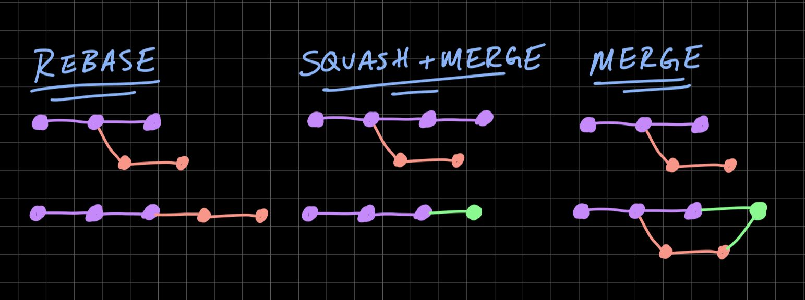
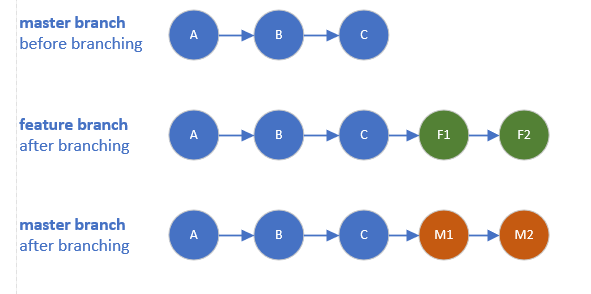

## Git

#### Git Branching - Basic Branching and Merging
You can run the git checkout command with the -b switch:
    $ git checkout -b iss53
    Switched to a new branch "iss53"
This is shorthand for:
    $ git branch iss53
    $ git checkout iss53

#### Merge Conflicts

Reference: https://git-scm.com/book/en/v2/Git-Branching-Basic-Branching-and-Merging

### Difference between Merge, Squash and Rebase

When version controlling your code with git, there are generally three choices when merging feature branches into main. 
Each has its quirks, so which one should you use?
##### Rebase rewrites history on top of a branch. This provides a linear history, meaning context is lost of where a 
feature branched off. You may also have to force push changes (since you are rewriting history) if you have already pushed to a remote.
##### Merge will create a merge commit that joins two branches together. With the fast-forward-only flag ff-only, git 
will attempt to merge without a merge commit, but this isn't possible if the branches have diverged (i.e., there has 
been a commit to the parent branch that's not on the feature branch).
##### Squash + Merge acts like merge but creates a single new squashed commit that encompasses all commits in the feature branch.
I use rebase. Rebase retains a linear commit history, which is important for rollbacks. In addition, rebase is the most flexible workflow – larger and more difficult merges can be tough to do with a squash and merge. Interactive rebase has a bit of a steeper learning curve, but with practice, it can work in all scenarios. Squash and merge is OK for smaller changes, but it might be smarter to break large feature branches into multiple logical commits. This is useful for cherry-picking commits to other branches or repositories.
Reference: https://matt-rickard.com/squash-merge-or-rebase

#### Options to merge changes of feature branch into master branch
##### Merge commits
Will keep all commits history of the feature branch and move them into the master branch
Will add extra dummy commit.
#####Rebase and merge
Will append all commits history of the feature branch in the front of the master branch
Will NOT add extra dummy commit.
#####Squash and merge
Will group all feature branch commits into one commit then append it in the front of the master branch
Will add extra dummy commit.

Reference: https://stackoverflow.com/questions/2427238/what-is-the-difference-between-merge-squash-and-rebase
