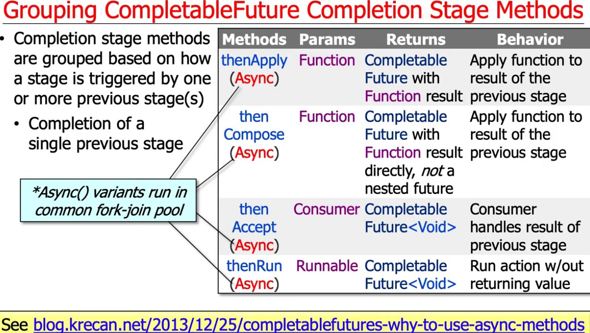
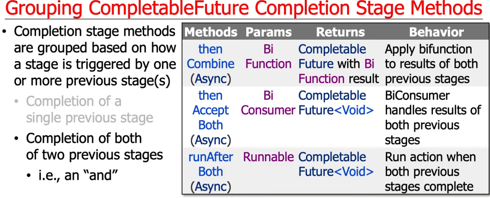
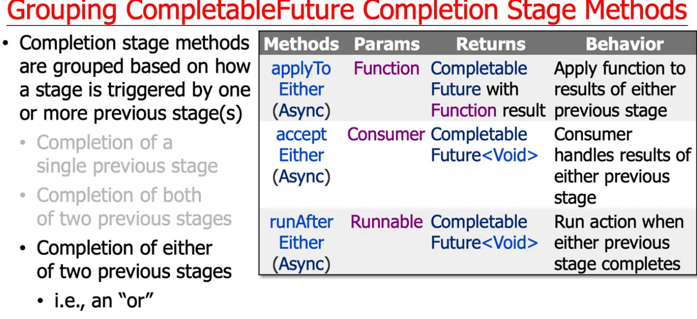

### How to process Results of an Asynchronous Computations
Reference: 
https://www.baeldung.com/java-completablefuture
https://github.com/eugenp/tutorials/blob/master/core-java-modules/core-java-concurrency-simple/src/test/java/com/baeldung/concurrent/completablefuture/CompletableFutureTimeoutUnitTest.java

The most generic way to process the result of a computation is to feed it to a function. The thenApply method does exactly that; it accepts a Function instance, uses it to process the result, and returns a Future that holds a value returned by a function:
```
    CompletableFuture<String> completableFuture  = CompletableFuture.supplyAsync(() -> "Hello");
    CompletableFuture<String> future = completableFuture.thenApply(s -> s + " World");
    
    assertEquals("Hello World", future.get());
```

If we don’t need to return a value down the Future chain, we can use an instance of the Consumer functional interface. Its single method takes a parameter and returns void.
There’s a method for this use case in the CompletableFuture. The thenAccept method receives a Consumer and passes it the result of the computation. Then the final future.get() call returns an instance of the Void type:
```
    CompletableFuture<String> completableFuture
      = CompletableFuture.supplyAsync(() -> "Hello");
    
    CompletableFuture<Void> future = completableFuture
      .thenAccept(s -> System.out.println("Computation returned: " + s));
    
    future.get();
```

Finally, if we neither need the value of the computation nor want to return some value at the end of the chain, then we can pass a Runnable lambda to the thenRun method. In the following example, we simply print a line in the console after calling the future.get():
```
CompletableFuture<String> completableFuture 
  = CompletableFuture.supplyAsync(() -> "Hello");

CompletableFuture<Void> future = completableFuture
  .thenRun(() -> System.out.println("Computation finished."));

future.get();
```
### thenApply vs thenCompose
```
    // https://stackoverflow.com/questions/43019126/completablefuture-thenapply-vs-thencompose
    // https://www.baeldung.com/java-completablefuture
    
    public CompletableFuture<Integer> processThenCompose(int userId) {
        // Get userInfo
        CompletableFuture<Integer> userInfoCF = CompletableFuture
                .supplyAsync(() -> getUserInfo(userId));

        // Pass the userInfo to get the userRating
        // Option 1: thenApply
        CompletableFuture<CompletableFuture<Integer>>  userRating1  = userInfoCF
                .thenApply(userInfo -> CompletableFuture.supplyAsync(() -> getUserRating(userInfo)));

        // Option 2: thenCompose
        CompletableFuture<Integer> userRating2 = userInfoCF
                .thenCompose( userInfo -> CompletableFuture.supplyAsync(() -> getUserRating(userInfo)));

        System.out.println(userRating2);
        return userRating2;
    }

```
### Running Multiple Futures in Parallel

```
    CompletableFuture<String> future1 = CompletableFuture.supplyAsync(() -> "Hello");
    CompletableFuture<String> future2 = CompletableFuture.supplyAsync(() -> "Beautiful");
    CompletableFuture<String> future3 = CompletableFuture.supplyAsync(() -> "World");
    CompletableFuture<Void> combinedFuture = CompletableFuture.allOf(future1, future2, future3);
        
    combinedFuture.get();    
    assertTrue(future1.isDone());
    assertTrue(future2.isDone());
    assertTrue(future3.isDone());
```

### Exception Handling
```
    //  S Hello, VJ
    //  T null
    //  S null
    //  T java.util.concurrent.CompletionException: java.lang.RuntimeException: Computation error!

    public CompletableFuture<String> processHandleExceptionsTest(String name){
        CompletableFuture<String> completableFuture
                =  CompletableFuture.supplyAsync(() -> returnResultsOrThrowAnException(name))
                                    .handle((data, exception) -> {
                                        System.out.println("Data " +data);
                                        System.out.println("Exception " +exception);
                                        return data != null ? data : "Hello, Stranger";
                                    })
                                    .thenApply(nam -> nam + "!");
        return completableFuture;
    }

    private static String returnResultsOrThrowAnException(String name) {
        if (name == null) {
            throw new RuntimeException("Computation error!");
        }
        return "Hello, " + name;
    }
```




