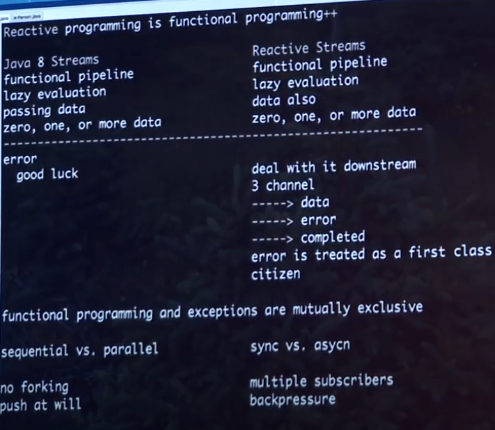

https://devdojo.com/ketonemaniac/reactor-onerrorcontinue-vs-onerrorresume

### Streams Api [Java 8]     Reactive Streams API [Flow API Java 9]

### 3 Channels
    data
    error
    completed

    Flowable.<Integer>create(emitter -> emit(emitter), BackpreassureStrategy.BUFFER)
        .onErrorResumeNext(...)
        .map(data -> data * 1)
        .subscribe(
            data -> System.out.println("DATA  " +data),
            err  -> System.out.println("ERROR " +err),
            ()   -> System.out.println("DONE") 
        );

    Flux<User> users = controller.handleRequest();
        users.subscribe(data -> System.out.println(data),
                        err -> System.out.println(err),
                        () -> System.out.println("DONE"));

https://youtu.be/U_NgcAg7jyY

### Should the lambdas be multiple lines
Never let the lambdas be multiple lines. If it gets more than a line,
- write that as a method and
- use that method reference and
- unit test that method separately. Can use stubs and mocks to test them.