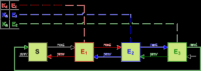
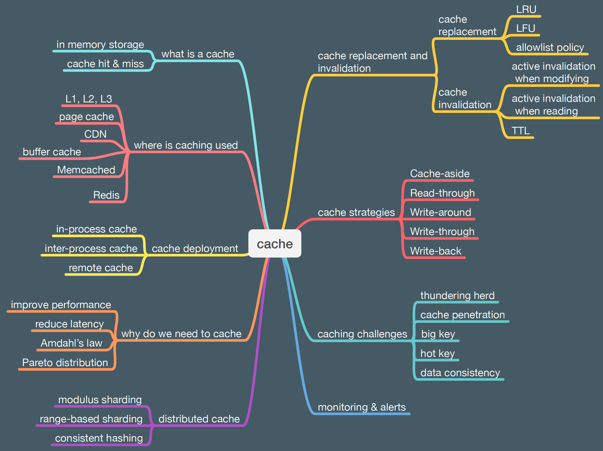

### Caching

### Caching in Java

#### Guava-cache

#### Caffeine Cache

#### Concurrent Linked HashMap
LinkedHashMap provides a convenient data structure that maintains the ordering of entries within the hash-table. This is
accomplished by cross-cutting the hash-table with a doubly-linked list, so that entries can be removed or reordered in
O(1) time. When operating in access-enrichedTransaction an entry is retrieved, unlinked, and relinked at the tail of the list. The
result is that the head element is the least recently used and the tail element is the most recently used. When bounded,
this class becomes a convenient LRU cache. linkedhashmap The problem with this approach is that every access operation
requires updating the list. To function in a concurrent setting the entire data structure must be synchronized.

Reference: https://github.com/ben-manes/concurrentlinkedhashmap/wiki/Design

### Caffeine versus Guava cache

The main difference is because Caffeine uses ring buffers to record & replay events, whereas Guava uses
ConcurrentLinkedQueue. The intent was always to migrate Guava over and it made sense to start simpler, but unfortunately
there was never interest in accepting those changes. The ring buffer approach avoids allocation, is bounded (lossy), and
cheaper to operate against. The remaining costs are due to a design mismatch. The original author of MapMaker was
enthusiastic about soft references as the solution to caching problems by deferring it to the GC. Unfortunately while
that can seem fast in microbenchmarks, it has horrible performance in practice due to causing stop-the-world GC
thrashing. The size-based solution had to be adapted into this work and that is not ideal. Caffeine optimizes for
size-based and also gains an improved hash table, whereas Guava handles reference caching more elegantly. Caffeine
doesn't create its own threads for maintenance or expiration. It does defer the cost to the commonPool, which slightly
improves user-facing latencies but not throughput. A future version might leverage CompletableFuture.delayedExecutor to
schedule the next expiration event without directly creating threads (for users who have business logic depending on
prompt removal notifications). ConcurrentLinkedHashMap and MapMaker were written at the same time and CLHM has similar
performance to Caffeine. I believe the difference is due to what scenarios the designers favored and optimized for,
which impacted how other features would be implemented. There is low hanging fruit to allow Guava to have similar
performance profile, but there isn't an internal champion to drive that (and even less so with Caffeine as a favored
alternative). Reference: https://stackoverflow.com/questions/55494488/caffeine-versus-guava-cache

### Distributed Caching

#### Redis

