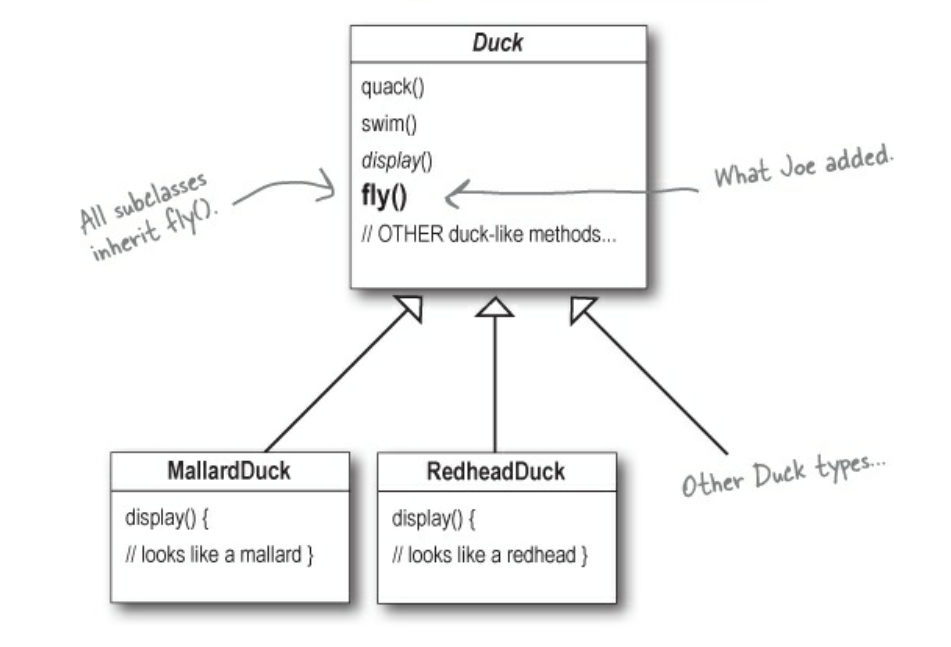
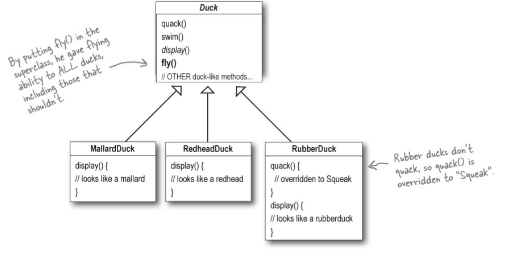
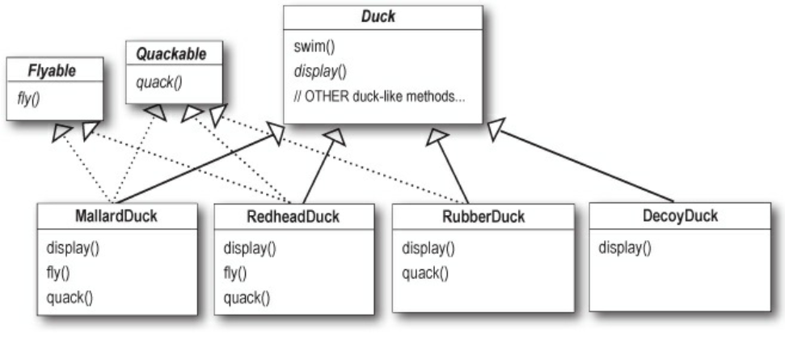
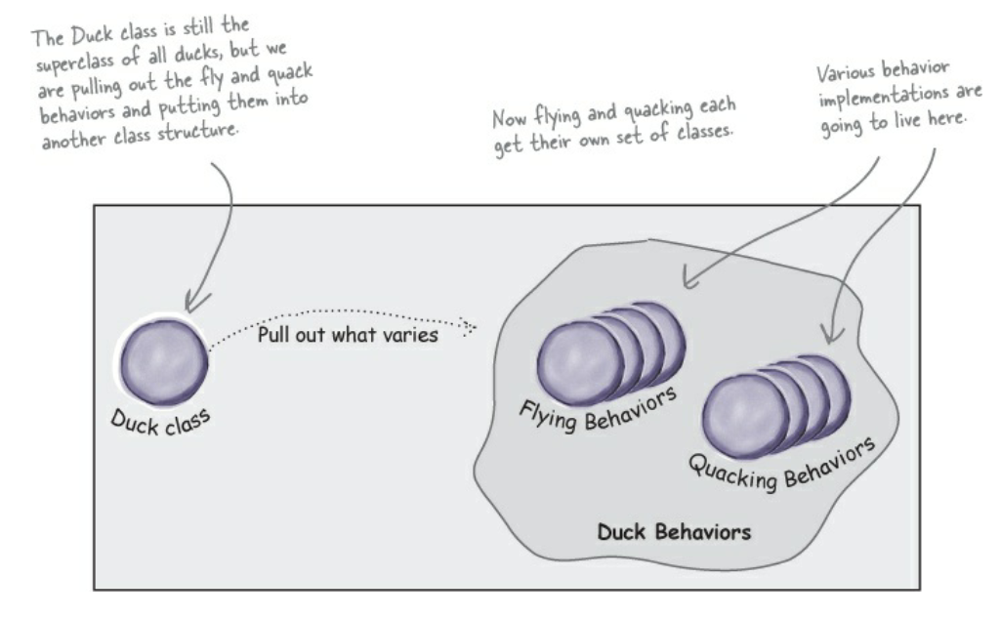
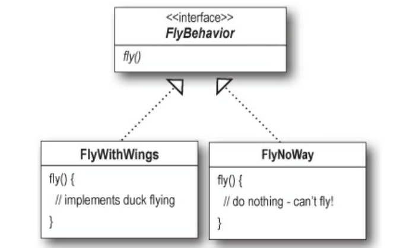
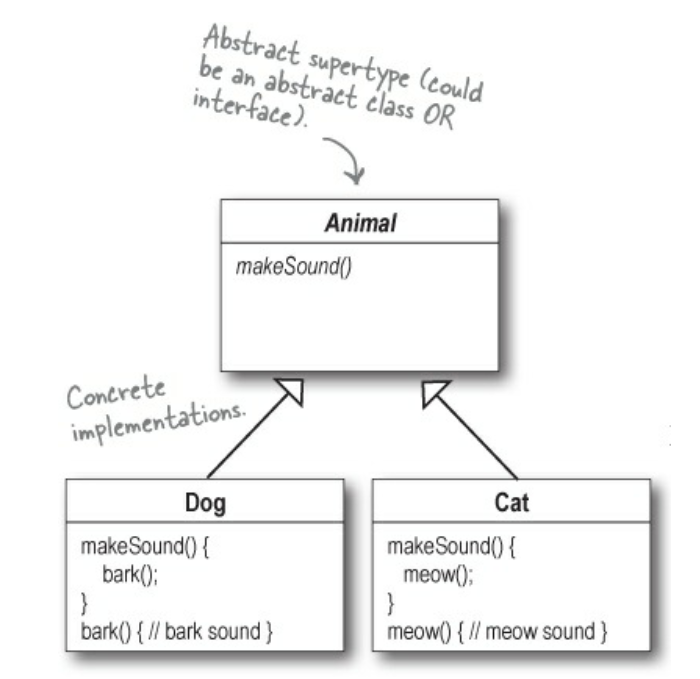
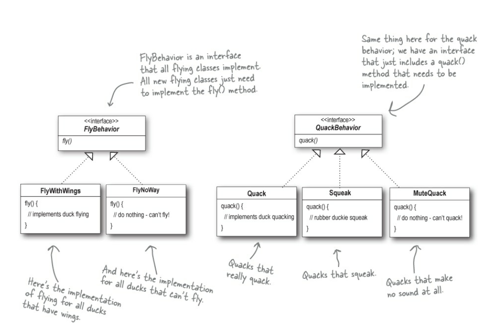
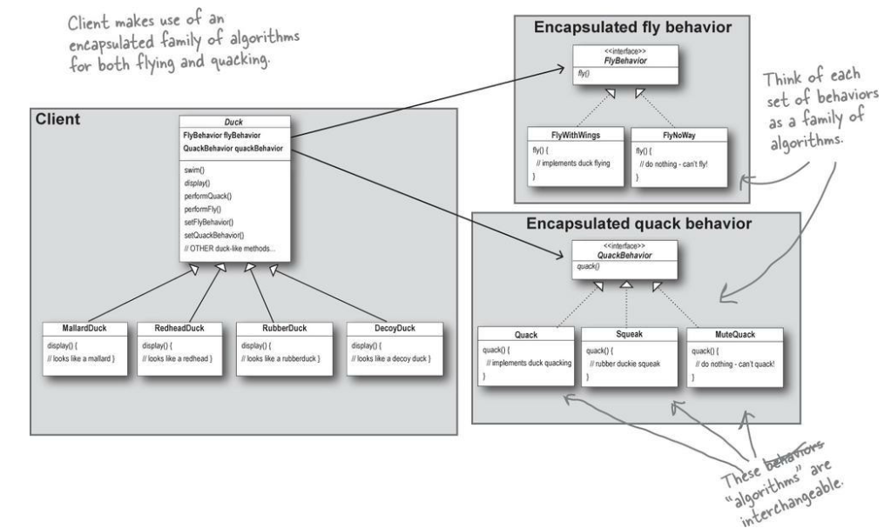

> Initial Design
- Duck Class - swim(), quack(), abstract display() behaviors
- All ducks quack and swim. The superclass takes care of the implementation code
- The display method is abstract, since all duck subtypes look different 
- Each duck subtype is responsible for implementing their own display() behavior
  - Specific instances of Ducks extend the Duck Class 
    - Mallard Duck - display(){ // Looks like mallard duck} 
    - RedheadDuck
    - Other duck types

> Add a Fly behavior
Let's see the design progression 
1. Use of inheritance
- Duck Class - swim(), quack(), abstract display(), fly() behaviors
- By putting fly() in the superclass, gives flying ability to ALL ducks including those that shouldn't
    - Mallard Duck - display(){ // Looks like mallard duck}
    - RedheadDuck  - display(){ // Looks like redhead duck}
    - RubberDuck   - quack()  { // Overridden to "squeak". rubber ducks do not quack} 
                   - display(){ // Looks like rubber duck}
- Adding the new behavior to the Duck superclass, he was also adding behavior that was not appropriate for 
- some Duck subclasses. He now has flying inanimate objects in the SimUDuck program.

>  Use of inheritance for the purpose of reuse has maintenance issues
- Use of inheritance for the purpose of reuse hasn’t turned out so well when it comes to maintenance
- Could just iverrude tge fky method in rubberduck, teh way the quack() method is overriden
- RubberDuck   - quack()  { // Overridden to "squeak". rubber ducks do not quack} 
               - display(){ // Looks like rubber duck}
               - fly()  { // Overridden to do nothing}
- But then what happens if we happen to add a Wooden DecoyDuck
- DecoyDuck    - quack()   // Overridden to do nothing}
               - display(){ // Looks like rubbedecoyr duck}
               - fly()  { // Overridden to do nothing}

> How about an interface?
- Joe realized that inheritance probably wasn’t the answer, because he just got a memo that says that the executives now want to update the product every
six months (in ways they haven’t yet decided on). Joe knows the spec will keep changing and he’ll be forced to look at and possibly override fly() and
quack() for every new Duck subclass that’s ever added to the program... forever. So, he needs a cleaner way to have only some (but not all) of the duck types fly or quack.

- Could take the fly() out of the Duck Superclass and make a Flyable() interface with fly() method. That way only the ducks that need to fly wiull implement that interface and have a fly() method... 
We might as well make a Quakable interface too, since not all ducks can quack.

> Problem with using the interfaces
- However, we now have to duplicate the code. If we thought overriding few methods was bad,  but if there is a slight change in the flying behaviour we might have to make that change in all the 48 flying Duck SubClasses
- We know that not all of the subclasses should have flying or quacking behavior, so inheritance isn’t the right answer. But while having the
subclasses implement Flyable and/or Quackable solves part of the problem (no inappropriately flying rubber ducks), it completely destroys code reuse
for those behaviors, so it just creates a different maintenance nightmare. And of course there might be more than one kind of flying behavior even among
the ducks that do fly...

> Zeroing in on the problem...
- So we know using inheritance hasn’t worked out very well, since the duck
behavior keeps changing across the subclasses, and it’s not appropriate for all
subclasses to have those behaviors. The Flyable and Quackable interface
sounded promising at first — only ducks that really do fly will be Flyable, 
etc. — except Java interfaces have no implementation code, so no code reuse.
And that means that whenever you need to modify a behavior, you’re forced
to track down and change it in all the different subclasses where that behavior
is defined, probably introducing new bugs along the way!
Luckily, there’s a design principle for just this situation. 

> DESIGN PRINCIPLE

Identify the aspects of your application that vary and separate them from what stays the same.
Take what varies and “encapsulate” it so it won’t affect the rest of your code.
The result? Fewer unintended consequences from code changes and more flexibility in your systems!

In other words, if you’ve got some aspect of your code that is changing, say
with every new requirement, then you know you’ve got a behavior that needs
to be pulled out and separated from all the stuff that doesn’t change

Here’s another way to think about this principle: take the parts that vary and encapsulate them, 
so that later you can alter or extend the parts that vary without affecting those that don’t.

As simple as this concept is, it forms the basis for almost every design pattern. All patterns provide a way to let 
some part of a system vary independently of all other parts. 

Okay, time to pull the duck behavior out of the Duck classes!

> Separating what changes from what stays the same

Where do we start? As far as we can tell, other than the problems with fly() and quack(), the Duck class is working well 
and there are no other parts of it that appear to vary or change frequently. So, other than a few slight changes, we’re 
going to pretty much leave the Duck class alone.
Now, to separate the “parts that change from those that stay the same,” we are going to create two sets of classes 
(totally apart from Duck), one for fly and one for quack. Each set of classes will hold all the implementations of the 
respective behavior. For instance, we might have one class that implements quacking, another that implements squeaking, 
and another that implements silence.

We know that fly() and quack() are the parts of the Duck class that vary across ducks.
To separate these behaviors from the Duck class, we’ll pull both methods out of the Duck class and create a new set of 
classes to represent each behavior.

> Designing the Duck Behaviors

So how are we going to design the set of classes that implement the fly
and quack behaviors?
We’d like to keep things flexible; after all, it was the inflexibility in the duck
behaviors that got us into trouble in the first place. And we know that we
want to assign behaviors to the instances of Duck. For example, we might
want to instantiate a new MallardDuck instance and initialize it with a
specific type of flying behavior. And while we’re there, why not make sure
that we can change the behavior of a duck dynamically? In other words, we
should include behavior setter methods in the Duck classes so that we can
change the MallardDuck’s flying behavior at runtime.
Given these goals, let’s look at our second design principle

> Designing the Duck Behaviors 
So how are we going to design the set of classes that implement the fly and quack behaviors? 
We’d like to keep things flexible; after all, it was the inflexibility in the duck behaviors that got us into trouble 
in the first place. And we know that we want to assign behaviors to the instances of Duck. For example, we might want to
instantiate a new MallardDuck instance and initialize it with a specific type of flying behavior. And while we’re there,
why not make sure that we can change the behavior of a duck dynamically? In other words, we should include behavior 
setter methods in the Duck classes so that we can change the MallardDuck’s flying behavior at runtime.
Given these goals, let’s look at our second design principle: 

> DESIGN PRINCIPLE
Program to an interface, not an implementation

>> From now on, the Duck behaviors will live in a separate class — a class that implements a particular behavior interface.
That way, the Duck classes won’t need to know any of the implementation details for their own behaviors.

We’ll use an interface to represent each behavior — for instance, FlyBehavior and QuackBehavior — and each implementation 
of a behavior will implement one of those interfaces. 

So this time it won’t be the Duck classes that will implement the flying and quacking interfaces. Instead, we’ll make a 
set of classes whose entire reason for living is to represent a behavior (for example, “squeaking”), and it’s the 
behavior class, rather than the Duck class, that will implement the behavior interface.

This is in contrast to the way we were doing things before, where a behavior came either from a concrete implementation 
in the superclass Duck, or by providing a specialized implementation in the subclass itself. In both cases we were 
relying on an implementation. We were locked into using that specific implementation and there was no room for changing 
the behavior (other than writing more code).

With our new design, the Duck subclasses will use a behavior represented by an interface (FlyBehavior and QuackBehavior), 
so that the actual implementation of the behavior (in other words, the specific concrete behavior coded in the class that 
implements the FlyBehavior or QuackBehavior) won’t be locked into the Duck subclass.

>Why you have to use an interface for FlyBehavior. You can do the same t5hing with an abstract superclass. Isn't the whole point to use polymorphism

“Program to an interface” really means “Program to a supertype.”

The word interface is overloaded here. There’s the concept of interface, but
there’s also the Java construct interface. You can program to an interface,
without having to actually use a Java interface. The point is to exploit
polymorphism by programming to a supertype so that the actual runtime
object isn’t locked into the code. And we could rephrase “program to a
supertype” as “the declared type of the variables should be a supertype,
usually an abstract class or interface, so that the objects assigned to those
variables can be of any concrete implementation of the supertype, which
means the class declaring them doesn’t have to know about the actual object
types!”

This is probably old news to you, but just to make sure we’re all saying the 
same thing, here’s a simple example of using a polymorphic type — imagine
an abstract class Animal, with two concrete implementations, Dog and Cat.

Programming to an implementation would be:
    Dog d = new Dog();
    d.bark();
NOTE: Declaring the variable “d” as type Dog (a concrete implementation of Animal) forces us to code to a concrete mplementation.

But programming to an interface/supertype would be:
    Animal animal = new Dog();
    animal.makeSound();
NOTE: We know it’s a Dog, but we can now use the animal reference polymorphically

Even better, rather than hardcoding the instantiation of the subtype (like new Dog()) into the code, assign the concrete 
implementation object at runtime:
    a = getAnimal();
    a.makeSound();
NOTE: We don’t know WHAT the actual animal subtype is... all we care about is that it knows how to respond to makeSound().

> Implementing the Duck Behaviors

Here we have the two interfaces, FlyBehavior and QuackBehavior, along with the corresponding classes that implement 
each concrete behavior:

NOTE: With this design, other types of objects can reuse our fly and quack behaviors because these behaviors are 
no longer hidden away in our Duck classes! And we can add new behaviors without modifying any of our existing behavior
classes or touching any of the Duck classes that use flying behaviors. So we get the benefit of REUSE without all the 
baggage that comes along with inheritance.

Q: Q: Do I always have to implement my application first, see where things are changing, and then go back and separate & encapsulate those things?
A: A: Not always; often when you are designing an application, you anticipate those areas that are going to vary and then go ahead and build the flexibility to deal with it into your code. You’ll find that the principles and patterns
can be applied at any stage of the development lifecycle.
Q: Q: Should we make Duck an interface too?
A: A: Not in this case. As you’ll see once we’ve got everything hooked together, we do benefit by having Duck not
be an interface, and having specific ducks, like MallardDuck, inherit common properties and methods. Now that
we’ve removed what varies from the Duck inheritance, we get the benefits of this structure without the problems.
Q: Q: It feels a little weird to have a class that’s just a behavior. Aren’t classes supposed to represent things?
Aren’t classes supposed to have both state AND behavior?
A: A: In an OO system, yes, classes represent things that generally have both state (instance variables) and methods.
And in this case, the thing happens to be a behavior. But even a behavior can still have state and methods; a flying
behavior might have instance variables representing the attributes for the flying (wing beats per minute, max
altitude, and speed, etc.) behavior

> The Big Picture on encapsulated behaviors

Okay, now that we’ve done the deep dive on the duck simulator design, it’s time to come back up for air and take a look 
at the big picture. Below is the entire reworked class structure. We have everything you’d expect: ducks extending Duck, 
fly behaviors implementing FlyBehavior, and quack behaviors implementing QuackBehavior.
Notice also that we’ve started to describe things a little differently. Instead of thinking of the duck behaviors as a 
set of behaviors, we’ll start thinking of them as a family of algorithms. Think about it: in the SimUDuck design, the
algorithms represent things a duck would do (different ways of quacking or flying), but we could just as easily use the 
same techniques for a set of classes that implement the ways to compute state sales tax by different states.
Pay careful attention to the relationships between the classes. In fact, grab your pen and write the appropriate 
relationship (IS-A, HAS-A, and IMPLEMENTS) on each arrow in the class diagram.

> HAS-A can be better than IS-A

The HAS-A relationship is an interesting one: each duck has a FlyBehavior and a QuackBehavior to which it delegates 
flying and quacking. When you put two classes together like this you’re using composition.
Instead of inheriting their behavior, the ducks get their behavior by being composed with the right behavior object.
This is an important technique; in fact, we’ve been using our third design principle:

DESIGN PRINCIPLE
Favor composition over inheritance.

As you’ve seen, creating systems using composition gives you a lot more flexibility. Not only does it let you 
encapsulate a family of algorithms into their own set of classes, but it also lets you change behavior at runtime as
long as the object you’re composing with implements the correct behavior interface.
Composition is used in many design patterns and you’ll see a lot more about its advantages and disadvantages throughout 
the book