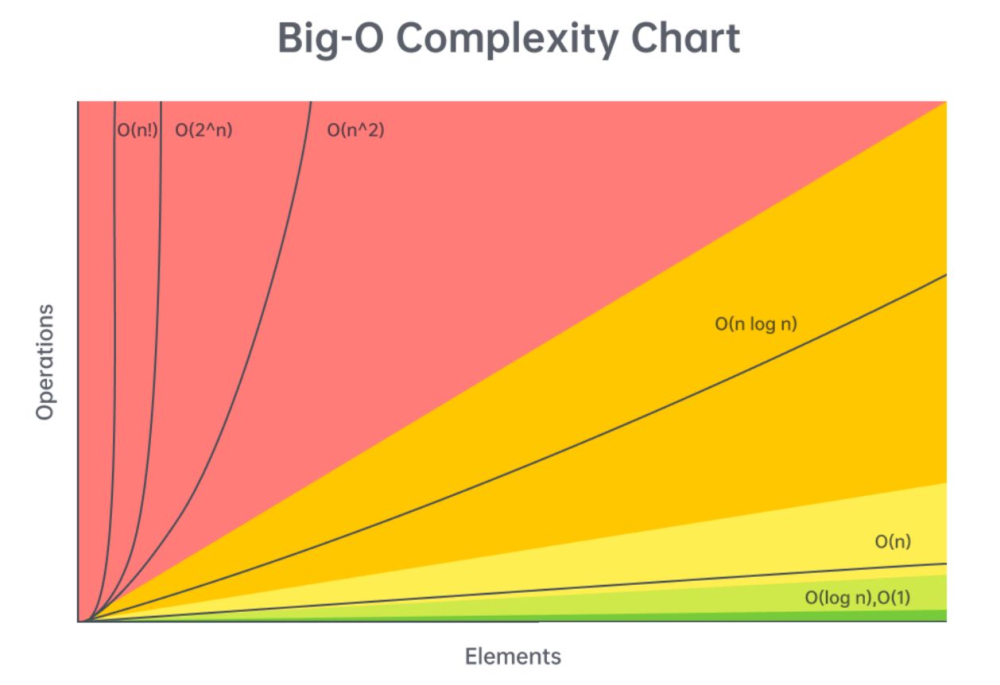
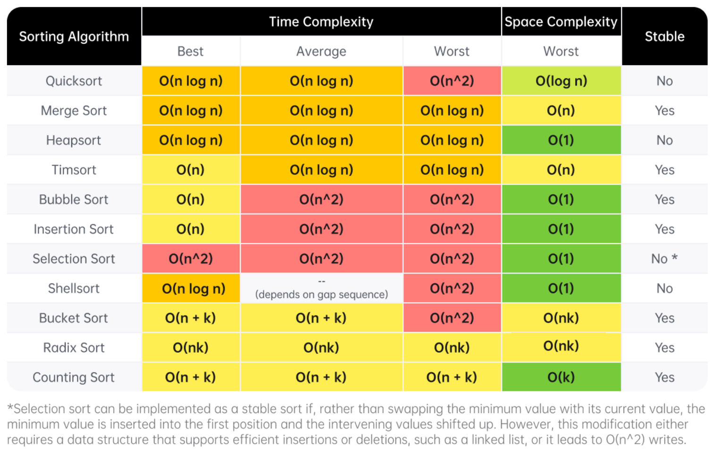
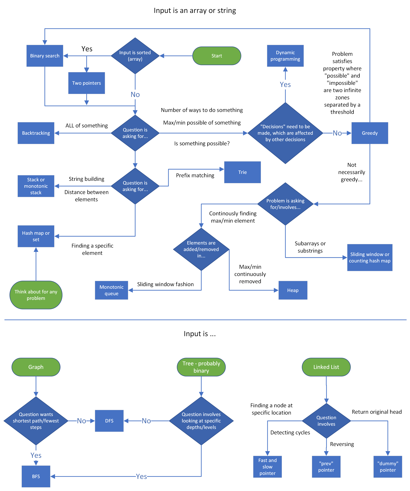

This article will be a collection of cheat sheets that you can use as you solve problems and prepare for interviews. You will find:

    Time complexity (Big O) cheat sheet
    General DS/A flowchart (when to use each DS/A)
    Stages of an interview cheat sheet

Time complexity (Big O) cheat sheet
    big O chart
    

First, let's talk about the time complexity of common operations, split by data structure/algorithm. Then, we'll talk about reasonable complexities given input sizes.

Arrays (dynamic array/list)

Given n = arr.length,

    Add or remove element at the end: O(1)O(1) amortized
    Add or remove element from arbitrary index: O(n)O(n)
    Access or modify element at arbitrary index: O(1)O(1)
    Check if element exists: O(n)O(n)
    Two pointers: O(n⋅k)O(n⋅k), where kk is the work done at each iteration, includes sliding window
    Building a prefix sum: O(n)O(n)
    Finding the sum of a subarray given a prefix sum: O(1)O(1)

Strings (immutable)

Given n = s.length,

    Add or remove character: O(n)O(n)
    Access element at arbitrary index: O(1)O(1)
    Concatenation between two strings: O(n+m)O(n+m), where mm is the length of the other string
    Create substring: O(m)O(m), where mm is the length of the substring
    Two pointers: O(n⋅k)O(n⋅k), where kk is the work done at each iteration, includes sliding window
    Building a string from joining an array, stringbuilder, etc.: O(n)O(n)

Linked Lists

Given nn as the number of nodes in the linked list,

    Add or remove element given pointer before add/removal location: O(1)O(1)
    Add or remove element given pointer at add/removal location: O(1)O(1) if doubly linked
    Add or remove element at arbitrary position without pointer: O(n)O(n)
    Access element at arbitrary position without pointer: O(n)O(n)
    Check if element exists: O(n)O(n)
    Reverse between position i and j: O(j−i)O(j−i)
    Detect a cycle: O(n)O(n) using fast-slow pointers or hash map

Hash table/dictionary

Given n = dic.length,

    Add or remove key-value pair: O(1)O(1)
    Check if key exists: O(1)O(1)
    Check if value exists: O(n)O(n)
    Access or modify value associated with key: O(1)O(1)
    Iterate over all keys, values, or both: O(n)O(n)

    Note: the O(1)O(1) operations are constant relative to n. In reality, the hashing algorithm might be expensive. For example, if your keys are strings, then it will cost O(m)O(m) where mm is the length of the string. The operations only take constant time relative to the size of the hash map.

Set

Given n = set.length,

    Add or remove element: O(1)O(1)
    Check if element exists: O(1)O(1)

    The above note applies here as well.

Stack

Stack operations are dependent on their implementation. A stack is only required to support pop and push. If implemented with a dynamic array:

Given n = stack.length,

    Push element: O(1)O(1)
    Pop element: O(1)O(1)
    Peek (see element at top of stack): O(1)O(1)
    Access or modify element at arbitrary index: O(1)O(1)
    Check if element exists: O(n)O(n)

Queue

Queue operations are dependent on their implementation. A queue is only required to support dequeue and enqueue. If implemented with a doubly linked list:

Given n = queue.length,

    Enqueue element: O(1)O(1)
    Dequeue element: O(1)O(1)
    Peek (see element at front of queue): O(1)O(1)
    Access or modify element at arbitrary index: O(n)O(n)
    Check if element exists: O(n)O(n)

    Note: most programming languages implement queues in a more sophisticated manner than a simple doubly linked list. Depending on implementation, accessing elements by index may be faster than O(n)O(n), or O(n)O(n) but with a significant constant divisor.

Binary tree problems (DFS/BFS)

Given nn as the number of nodes in the tree,

Most algorithms will run in O(n⋅k)O(n⋅k) time, where kk is the work done at each node, usually O(1)O(1). This is just a general rule and not always the case. We are assuming here that BFS is implemented with an efficient queue.

Binary search tree

Given nn as the number of nodes in the tree,

    Add or remove element: O(n)O(n) worst case, O(log⁡n)O(logn) average case
    Check if element exists: O(n)O(n) worst case, O(log⁡n)O(logn) average case

The average case is when the tree is well balanced - each depth is close to full. The worst case is when the tree is just a straight line.

Heap/Priority Queue

Given n = heap.length and talking about min heaps,

    Add an element: O(log⁡n)O(logn)
    Delete the minimum element: O(log⁡n)O(logn)
    Find the minimum element: O(1)O(1)
    Check if element exists: O(n)O(n)

Binary search

Binary search runs in O(log⁡n)O(logn) in the worst case, where nn is the size of your initial search space.

Miscellaneous

    Sorting: O(n⋅log⁡n)O(n⋅logn), where nn is the size of the data being sorted
    DFS and BFS on a graph: O(n⋅k+e)O(n⋅k+e), where nn is the number of nodes, ee is the number of edges, if each node is handled in O(1)O(1) other than iterating over edges
    DFS and BFS space complexity: typically O(n)O(n), but if it's in a graph, might be O(n+e)O(n+e) to store the graph
    Dynamic programming time complexity: O(n⋅k)O(n⋅k), where nn is the number of states and kk is the work done at each state
    Dynamic programming space complexity: O(n)O(n), where nn is the number of states

Input sizes vs time complexity

The constraints of a problem can be considered as hints because they indicate an upper bound on what your solution's time complexity should be. Being able to figure out the expected time complexity of a solution given the input size is a valuable skill to have. In all LeetCode problems and most online assessments (OA), you will be given the problem's constraints. Unfortunately, you will usually not be explicitly told the constraints of a problem in an interview, but it's still good for practicing on LeetCode and completing OAs. Still, in an interview, it usually doesn't hurt to ask about the expected input sizes.

n <= 10

The expected time complexity likely has a factorial or an exponential with a base larger than 2 - O(n2⋅n!)O(n2⋅n!) or O(4n)O(4n) for example.

You should think about backtracking or any brute-force-esque recursive algorithm. n <= 10 is extremely small and usually any algorithm that correctly finds the answer will be fast enough.

10 < n <= 20

The expected time complexity likely involves O(2n)O(2n). Any higher base or a factorial will be too slow (320320 = ~3.5 billion, and 20!20! is much larger). A 2n2n usually implies that given a collection of elements, you are considering all subsets/subsequences - for each element, there are two choices: take it or don't take it.

Again, this bound is very small, so most algorithms that are correct will probably be fast enough. Consider backtracking and recursion.

20 < n <= 100

At this point, exponentials will be too slow. The upper bound will likely involve O(n3)O(n3).

Problems marked as "easy" on LeetCode usually have this bound, which can be deceiving. There may be solutions that run in O(n)O(n), but the small bound allows brute force solutions to pass (finding the linear time solution might not be considered as "easy").

Consider brute force solutions that involve nested loops. If you come up with a brute force solution, try analyzing the algorithm to find what steps are "slow", and try to improve on those steps using tools like hash maps or heaps.

100 < n <= 1,000

In this range, a quadratic time complexity O(n2)O(n2) should be sufficient, as long as the constant factor isn't too large.

Similar to the previous range, you should consider nested loops. The difference between this range and the previous one is that O(n2)O(n2) is usually the expected/optimal time complexity in this range, and it might not be possible to improve.

1,000 < n < 100,000

n<=105n<=105 is the most common constraint you will see on LeetCode. In this range, the slowest acceptable common time complexity is O(n⋅log⁡n)O(n⋅logn), although a linear time approach O(n)O(n) is commonly the goal.

In this range, ask yourself if sorting the input or using a heap can be helpful. If not, then aim for an O(n)O(n) algorithm. Nested loops that run in O(n2)O(n2) are unacceptable - you will probably need to make use of a technique learned in this course to simulate a nested loop's behavior in O(1)O(1) or O(log⁡n)O(logn):

    Hash map
    A two pointers implementation like sliding window
    Monotonic stack
    Binary search
    Heap
    A combination of any of the above

If you have an O(n)O(n) algorithm, the constant factor can be reasonably large (around 40). One common theme for string problems involves looping over the characters of the alphabet at each iteration resulting in a time complexity of O(26n)O(26n).

100,000 < n < 1,000,000

n<=106n<=106 is a rare constraint, and will likely require a time complexity of O(n)O(n). In this range, O(n⋅log⁡n)O(n⋅logn) is usually safe as long as it has a small constant factor. You will very likely need to incorporate a hash map in some way.

1,000,000 < n

With huge inputs, typically in the range of 109109 or more, the most common acceptable time complexity will be logarithmic O(log⁡n)O(logn) or constant O(1)O(1). In these problems, you must either significantly reduce your search space at each iteration (usually binary search) or use clever tricks to find information in constant time (like with math or a clever use of hash maps).

    Other time complexities are possible like O(n)O(n

    ​), but this is very rare and will usually only be seen in very advanced problems.

Sorting algorithms

All major programming languages have a built-in method for sorting. It is usually correct to assume and say sorting costs O(n⋅log⁡n)O(n⋅logn), where nn is the number of elements being sorted. For completeness, here is a chart that lists many common sorting algorithms and their completeness. The algorithm implemented by a programming language varies; for example, Python uses Timsort but in C++, the specific algorithm is not mandated and varies.

Sorting algorithm complexities
    
    
    Definition of a stable sort from Wikipedia: "Stable sorting algorithms maintain the relative order of records with equal keys (i.e. values). That is, a sorting algorithm is stable if whenever there are two records R and S with the same key and with R appearing before S in the original list, R will appear before S in the sorted list."

General DS/A flowchart

Here's a flowchart that can help you figure out which data structure or algorithm should be used. Note that this flowchart is very general as it would be impossible to cover every single scenario.
    
    Note that this flowchart only covers methods taught in LICC, and as such more advanced algorithms like Dijkstra's is excluded.

data structures and algorithm flowchart
Interview stages cheat sheet

The following will be a summary of the "Stages of an interview" article. If you have a remote interview, you can print this condensed version and keep it in front of you during the interview.

Stage 1: Introductions

    Have a rehearsed 30-60 second introduction regarding your education, work experience, and interests prepared.
    Smile and speak with confidence.
    Pay attention when the interviewer talks about themselves and incorporate their work into your questions later.

Stage 2: Problem statement

    Paraphrase the problem back to the interviewer after they have read it to you.
    Ask clarifying questions about the input such as the expected input size, edge cases, and invalid inputs.
    Quickly walk through an example test case to confirm you understand the problem.

Stage 3: Brainstorming DS&A

    Always be thinking out loud.
    Break the problem down: figure out what you need to do, and think about what data structure or algorithm can accomplish it with a good time complexity.
    Be receptive to any comments or feedback from the interviewer, they are probably trying to hint you towards the correct solution.
    Once you have an idea, before coding, explain your idea to the interviewer and make sure they understand and agree that it is a reasonable approach.

Stage 4: Implementation

    Explain your decision-making as you implement. When you declare things like sets, explain what the purpose is.
    Write clean code that conforms to your programming language's conventions.
    Avoid writing duplicate code - use a helper function or for loop if you are writing similar code multiple times.
    If you are stuck, don't panic - communicate your concerns with your interviewer.
    Don't be scared to start with a brute force solution (while acknowledging that it is brute force), then improve it by optimizing the "slow" parts.
    Keep thinking out loud and talk with your interviewer. It makes it easier for them to give you hints.

Stage 5: Testing & debugging

    When walking through test cases, keep track of the variables by writing at the bottom of the file, and continuously update them. Condense trivial parts like creating a prefix sum to save time.
    If there are errors and the environment supports running code, put print statements in your algorithm and walk through a small test case, comparing the expected value of variables and the actual values.
    Be vocal and keep talking with your interviewer if you run into any problems.

Stage 6: Explanations and follow-ups

Questions you should be prepared to answer:

    Time and space complexity, average and worst case.
    Why did you choose this data structure, algorithm, or logic?
    Do you think the algorithm could be improved in terms of complexity? If they ask you this, then the answer is usually yes, especially if your algorithm is slower than O(n)O(n).

Stage 7: Outro

    Have questions regarding the company prepared.
    Be interested, smile, and ask follow-up questions to your interviewer's responses.

